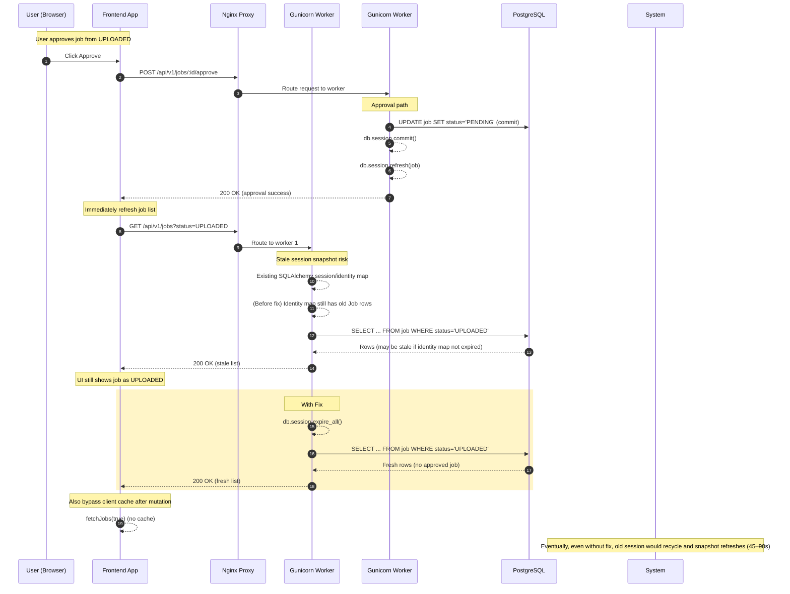

# Sequence Diagram: Approval → Stale Read → Eventual Consistency

```mermaid
sequenceDiagram
    autonumber
    participant U as User (Browser)
    participant FE as Frontend App
    participant NG as Nginx Proxy
    participant GW1 as Gunicorn Worker #1
    participant GW2 as Gunicorn Worker #2
    participant DB as PostgreSQL

    Note over U,FE: User approves job from UPLOADED
    U->>FE: Click Approve
    FE->>NG: POST /api/v1/jobs/:id/approve
    NG->>GW2: Route request to worker

    Note over GW2: Approval path
    GW2->>DB: UPDATE job SET status='PENDING' (commit)
    GW2-->>GW2: db.session.commit()
    GW2-->>GW2: db.session.refresh(job)
    GW2-->>FE: 200 OK (approval success)

    Note over FE: Immediately refresh job list
    FE->>NG: GET /api/v1/jobs?status=UPLOADED
    NG->>GW1: Route to worker 1

    Note over GW1: Stale session snapshot risk
    GW1-->>GW1: Existing SQLAlchemy session/identity map
    GW1-->>GW1: (Before fix) Identity map still has old Job rows
    GW1->>DB: SELECT ... FROM job WHERE status='UPLOADED'
    DB-->>GW1: Rows (may be stale if identity map not expired)
    GW1-->>FE: 200 OK (stale list)

    Note over FE: UI still shows job as UPLOADED

    rect rgb(255, 245, 200)
    Note over GW1: With Fix
    GW1-->>GW1: db.session.expire_all()
    GW1->>DB: SELECT ... FROM job WHERE status='UPLOADED'
    DB-->>GW1: Fresh rows (no approved job)
    GW1-->>FE: 200 OK (fresh list)
    end

    Note over FE: Also bypass client cache after mutation
    FE-->>FE: fetchJobs(true) (no cache)

    Note over System: Eventually, even without fix, old session would recycle and snapshot refreshes (45–90s)
```
