# Cross-File Dependencies Analysis

## Overview

This document provides a comprehensive analysis of dependencies between the four target route files, identifying shared components, circular dependency risks, and opportunities for shared service extraction.

## Current Dependency Mapping

### Shared Import Analysis

#### **Core Framework Dependencies** (Used by all files)
```python
from flask import Blueprint, request, jsonify, abort, g
from app import db, limiter
from app.utils.decorators import token_required
```

#### **Model Dependencies by File**

| File | Job | Event | Payment | Staff | Usage Pattern |
|------|-----|-------|---------|-------|---------------|
| **jobs.py** | ✓ | ✓ | ✓ | ✓ | **Heavy CRUD operations** |
| **analytics.py** | ✓ | ✓ | ✓ | ✓ | **Read-only aggregations** |
| **admin.py** | ✓ | ✓ | ✓ | ✓ | **System maintenance operations** |
| **jobs_staff.py** | ✓ | ✓ | ✓ | ✓ | **Staff workflow operations** |

**Analysis**: All files depend on all models, indicating tight coupling and opportunities for service layer abstraction.

#### **Service Dependencies by File**

| Service | jobs.py | analytics.py | admin.py | jobs_staff.py | Risk Level |
|---------|---------|--------------|----------|---------------|------------|
| **email_service** | ✓ | ✗ | ✓ | ✓ | **Medium** |
| **file_service** | ✓ | ✗ | ✓ | ✓ | **High** |
| **token_service** | ✓ | ✗ | ✓ | ✓ | **Low** |
| **event_service** | ✓ | ✗ | ✓ | ✓ | **Medium** |
| **catalog_service** | ✓ | ✗ | ✗ | ✓ | **Low** |
| **error_handling_service** | ✓ | ✗ | ✓ | ✗ | **Medium** |

### Detailed Dependency Graph

```mermaid
graph TB
    subgraph "Route Files"
        Jobs[jobs.py<br/>1126 lines]
        Analytics[analytics.py<br/>1013 lines]
        Admin[admin.py<br/>535 lines]
        JobsStaff[jobs_staff.py<br/>571 lines]
    end
    
    subgraph "Models"
        JobModel[Job Model]
        EventModel[Event Model]
        PaymentModel[Payment Model]
        StaffModel[Staff Model]
    end
    
    subgraph "Services"
        EmailSvc[EmailService]
        FileSvc[FileService]
        TokenSvc[TokenService]
        EventSvc[EventService]
        CatalogSvc[CatalogService]
        ErrorSvc[ErrorHandlingService]
    end
    
    Jobs --> JobModel
    Jobs --> EventModel
    Jobs --> PaymentModel
    Jobs --> StaffModel
    Jobs --> EmailSvc
    Jobs --> FileSvc
    Jobs --> TokenSvc
    Jobs --> EventSvc
    Jobs --> CatalogSvc
    Jobs --> ErrorSvc
    
    Analytics --> JobModel
    Analytics --> EventModel
    Analytics --> PaymentModel
    Analytics --> StaffModel
    
    Admin --> JobModel
    Admin --> EventModel
    Admin --> PaymentModel
    Admin --> StaffModel
    Admin --> EmailSvc
    Admin --> FileSvc
    Admin --> TokenSvc
    Admin --> EventSvc
    Admin --> ErrorSvc
    
    JobsStaff --> JobModel
    JobsStaff --> EventModel
    JobsStaff --> PaymentModel
    JobsStaff --> StaffModel
    JobsStaff --> EmailSvc
    JobsStaff --> FileSvc
    JobsStaff --> TokenSvc
    JobsStaff --> EventSvc
    JobsStaff --> CatalogSvc
```



## Functional Overlap Analysis

### **High Overlap Areas** (80%+ code similarity)

#### 1. **Job Validation & Staff Authentication**
**Files**: jobs.py, jobs_staff.py  
**Duplicate Code**: 
```python
# Repeated in both files
def _validate_staff_and_body(data):
    staff_name = data.get('staff_name')
    if not staff_name:
        return None, jsonify({'message': 'staff_name is required'}), 400
    staff = Staff.query.get(staff_name)
    if not staff or not staff.is_active:
        return None, jsonify({'message': 'Invalid or inactive staff_name'}), 400
    return staff_name, None, None
```

#### 2. **Database Transaction Patterns**
**Files**: jobs.py, admin.py, jobs_staff.py  
**Pattern**:
```python
# Repeated transaction pattern
job.status = new_status
job.last_updated_by = staff_name
db.session.add(job)
db.session.commit()
# Log event
evt = Event(job_id=job.id, event_type=event_type, ...)
db.session.add(evt)
db.session.commit()
```

#### 3. **Metadata Synchronization Logic**
**Files**: jobs.py, admin.py  
**Complex duplication**: Metadata sync operations with file path resolution and error handling

### **Medium Overlap Areas** (40-79% similarity)

#### 1. **Error Response Patterns**
**Files**: All files  
**Pattern**: Consistent error message formatting and HTTP status codes

#### 2. **Date Range Parsing**
**Files**: analytics.py (could be reused in admin.py for archival operations)

#### 3. **File Path Validation**
**Files**: jobs.py, admin.py  
**Security-critical**: Path traversal protection and storage root validation

### **Shared Business Logic Opportunities**

#### 1. **Job Lifecycle Management**
```python
# Extractable Service
class JobLifecycleService:
    def approve_job(self, job_id: str, staff_name: str, approval_data: dict)
    def reject_job(self, job_id: str, staff_name: str, rejection_data: dict)
    def transition_status(self, job_id: str, from_status: str, to_status: str, staff_name: str)
    def validate_status_transition(self, current_status: str, target_status: str)
```

#### 2. **Payment Processing Service**
```python
class PaymentService:
    def calculate_cost(self, material: str, weight_grams: float)
    def record_payment(self, job_id: str, payment_data: dict, staff_name: str)
    def validate_payment_data(self, payment_data: dict)
```

#### 3. **Analytics Data Service**
```python
class AnalyticsDataService:
    def get_job_metrics(self, start_date: datetime, end_date: datetime, filters: dict)
    def get_staff_performance(self, start_date: datetime, end_date: datetime)
    def get_financial_summary(self, start_date: datetime, end_date: datetime)
```

## Circular Dependency Risk Assessment

### **Current Risk Factors**

#### 1. **High Risk: jobs.py ↔ jobs_staff.py**
- Both files handle job status transitions
- Shared utility functions imported from relative module
- **Risk**: Circular import if extracted utilities reference both files

#### 2. **Medium Risk: admin.py ↔ file services**
- Admin operations modify job file locations
- File services used by job operations that admin monitors
- **Risk**: Circular dependency in audit/repair operations

#### 3. **Low Risk: analytics.py interactions**
- Primarily read-only operations
- Minimal cross-references with other route files
- **Risk**: Cache invalidation dependencies

### **Dependency Breaking Strategies**

#### 1. **Service Layer Introduction**
```python
# Break direct model access with service abstraction
class JobService:
    def __init__(self, db_session, event_service, file_service):
        self.db = db_session
        self.events = event_service
        self.files = file_service
```

#### 2. **Event-Driven Architecture for Cross-Cutting Concerns**
```python
# Replace direct calls with events
from app.events import publish_event

# Instead of direct service calls
publish_event('job.approved', {
    'job_id': job.id,
    'staff_name': staff_name,
    'approval_data': data
})
```

#### 3. **Interface Segregation**
```python
# Define focused interfaces to reduce coupling
class JobReader(ABC):
    def get_job(self, job_id: str) -> Job: ...
    def list_jobs(self, filters: dict) -> List[Job]: ...

class JobWriter(ABC):
    def update_job(self, job_id: str, updates: dict): ...
    def transition_status(self, job_id: str, new_status: str): ...
```

## Shared Component Opportunities

### **High-Value Extractions**

#### 1. **Validation Service** (Impact: All files)
```python
class ValidationService:
    def validate_staff(self, staff_name: str) -> Staff
    def validate_job_exists(self, job_id: str) -> Job
    def validate_status_transition(self, from_status: str, to_status: str) -> bool
    def validate_file_path(self, file_path: str) -> bool
    def validate_payment_data(self, payment_data: dict) -> bool
```

#### 2. **Response Handler Service** (Impact: All files)
```python
class ResponseService:
    def success(self, data: dict, status: int = 200) -> Response
    def error(self, message: str, status: int = 400) -> Response
    def validation_error(self, field: str, message: str) -> Response
    def not_found(self, resource: str) -> Response
```

#### 3. **Database Transaction Service** (Impact: jobs.py, admin.py, jobs_staff.py)
```python
class TransactionService:
    def execute_job_transition(self, job: Job, new_status: str, staff_name: str, details: dict)
    def execute_with_event_log(self, operation: Callable, event_type: str, details: dict)
    def rollback_on_error(self, operation: Callable)
```

### **Medium-Value Extractions**

#### 1. **Date Utility Service**
- Extract from analytics.py
- Reuse in admin.py for archival date calculations
- Standardize timezone handling across the application

#### 2. **File Operation Service**
- Centralize file path validation
- Standardize metadata sync operations
- Provide atomic file operations with rollback

#### 3. **Caching Service**
- Extract from analytics.py
- Provide consistent caching patterns for other routes
- Enable cache invalidation on data changes

## Interface Design for Refactored Components

### **Core Business Services**

#### 1. **Job Management Interface**
```python
class IJobService:
    def get_job(self, job_id: str) -> Job
    def list_jobs(self, filters: JobFilters) -> List[Job]
    def approve_job(self, job_id: str, approval: JobApproval) -> JobResult
    def reject_job(self, job_id: str, rejection: JobRejection) -> JobResult
    def transition_status(self, job_id: str, transition: StatusTransition) -> JobResult
    def lock_job(self, job_id: str, workstation_id: str) -> LockResult
    def unlock_job(self, job_id: str, workstation_id: str) -> bool
```

#### 2. **Analytics Service Interface**
```python
class IAnalyticsService:
    def get_overview_metrics(self, date_range: DateRange, filters: AnalyticsFilters) -> OverviewMetrics
    def get_trend_data(self, date_range: DateRange, metric_type: str) -> TrendData
    def get_staff_performance(self, date_range: DateRange) -> StaffPerformanceData
    def get_financial_summary(self, date_range: DateRange) -> FinancialSummary
```

#### 3. **Admin Service Interface**
```python
class IAdminService:
    def perform_system_audit(self) -> SystemAuditReport
    def archive_jobs(self, retention_days: int, staff_name: str) -> ArchivalResult
    def prune_jobs(self, retention_days: int, staff_name: str) -> PruningResult
    def repair_metadata(self, job_id: str, staff_name: str) -> RepairResult
    def monitor_errors(self) -> ErrorMonitoringReport
```

### **Supporting Services**

#### 1. **Validation Service Interface**
```python
class IValidationService:
    def validate_staff(self, staff_name: str) -> ValidationResult[Staff]
    def validate_job_access(self, job_id: str) -> ValidationResult[Job]
    def validate_status_transition(self, current: str, target: str) -> ValidationResult[bool]
    def validate_approval_data(self, data: dict) -> ValidationResult[ApprovalData]
```

#### 2. **Event Service Interface**
```python
class IEventService:
    def log_job_event(self, job_id: str, event_type: str, details: dict, staff_name: str)
    def log_system_event(self, event_type: str, details: dict, staff_name: str)
    def get_job_events(self, job_id: str) -> List[Event]
```

## Migration Strategy for Dependencies

### **Phase 1: Shared Utility Extraction**
1. **Create shared validation module**
   - Extract common validation functions
   - Update all files to use shared module
   - Ensure no circular imports

2. **Create shared response handlers**
   - Standardize error response patterns
   - Extract success response formatting
   - Update all endpoints to use shared handlers

### **Phase 2: Service Layer Introduction**
1. **Extract job lifecycle service**
   - Move business logic from routes to service
   - Maintain API compatibility through route delegation
   - Add comprehensive unit tests for service layer

2. **Extract analytics service**
   - Separate data aggregation from route handling
   - Implement caching at service level
   - Add performance monitoring

### **Phase 3: Interface Standardization**
1. **Define service interfaces**
   - Create abstract base classes for services
   - Implement interfaces in extracted services
   - Enable dependency injection for testing

2. **Implement cross-cutting concerns**
   - Add logging standardization
   - Implement error handling consistency
   - Add performance monitoring hooks

## Risk Mitigation for Dependency Changes

### **Breaking Change Prevention**
- **API contract testing**: Ensure all endpoints maintain identical behavior
- **Integration testing**: Verify end-to-end workflows remain functional
- **Rollback procedures**: Maintain ability to revert any service extraction

### **Performance Impact Monitoring**
- **Baseline metrics**: Establish current performance measurements
- **Service boundary overhead**: Monitor additional abstraction layers
- **Database query optimization**: Ensure service layer doesn't impact query efficiency

### **Import Cycle Detection**
- **Static analysis tools**: Use automated detection for circular imports
- **Dependency visualization**: Maintain clear dependency graphs
- **Module isolation testing**: Verify services can be imported independently

## Success Metrics for Dependency Management

### **Quantitative Goals**
- **Reduce import statements per file by 40%**
- **Eliminate 90%+ of code duplication**  
- **Achieve 100% API compatibility preservation**
- **Maintain or improve current response times**

### **Qualitative Improvements**
- **Clear service boundaries** with single responsibility
- **Testable service interfaces** with dependency injection
- **Reduced coupling** between route files and direct model access
- **Improved maintainability** through consistent patterns

---

**Next Steps**: Proceed with detailed implementation roadmap based on this dependency analysis.
