# 3D Print System Codebase Visualization

```mermaid
graph TB
    %% Entry Point
    A[🚀 app.py - Application Entry Point] --> B[⚙️ create_app function - Flask Factory Pattern]
    
    %% Core Application Structure
    B --> C[🏛️ Flask Application Instance]
    
    subgraph "Configuration Layer"
        C --> D[📋 Configuration Management]
        D --> D1[🔧 config.py - App Settings]
        D --> D2[🌍 Environment Variables - .env file]
        D --> D3[📁 Storage Directories Auto-Creation]
        D --> D4[🔐 Secret Key Management]
        D --> D5[🗄️ Database Connection String]
    end
    
    subgraph "Flask Extensions"
        C --> E[🔌 Extensions Integration]
        E --> E1[📄 extensions.py - Extension Registry]
        E1 --> E2[🗃️ SQLAlchemy Database ORM]
        E1 --> E3[🔄 Flask-Migrate Schema Management]
        E1 --> E4[🎨 Jinja2 Template Engine]
    end
    
    subgraph "Data Models Layer"
        C --> F[📊 Data Models]
        F --> F1[💼 models/job.py - Core Job Entity]
        F --> F2[📝 models/event.py - Audit Trail]
        F1 --> F3[🎯 Job Model - UUID Primary Key]
        F2 --> F4[📋 Event Model - Status Changes]
        F3 -.->|One-to-Many Relationship| F4
        
        F3 --> F31[👤 Student Information Fields]
        F3 --> F32[📄 File Metadata Fields]
        F3 --> F33[🔄 Status Workflow Fields]
        F3 --> F34[🖨️ Printer Configuration Fields]
        F3 --> F35[💰 Cost Calculation Fields]
        F3 --> F36[✅ Confirmation System Fields]
    end
    
    subgraph "Route Handlers - Controllers"
        C --> G[🛣️ HTTP Route Management]
        G --> G1[📤 routes/main.py - Student Portal]
        G --> G2[📊 routes/dashboard.py - Staff Interface]
        
        G1 --> G11[📋 Student Submission Form]
        G1 --> G12[✅ Email Confirmation Handler]
        G1 --> G13[👀 Student Job Status View]
        
        G2 --> G21[📈 Staff Dashboard Overview]
        G2 --> G22[🔄 Job Status Update Actions]
        G2 --> G23[📁 File Management Operations]
        G2 --> G24[💰 Cost Calculation Interface]
        G2 --> G25[🏷️ Job Tagging and Notes]
    end
    
    subgraph "Business Logic Services"
        C --> H[⚡ Service Layer]
        H --> H1[📁 services/file_service.py - File Operations]
        
        H1 --> H11[📤 File Upload Processing]
        H1 --> H12[🔍 File Validation and Parsing]
        H1 --> H13[📏 Metadata Extraction STL/3MF]
        H1 --> H14[🖼️ Thumbnail Generation]
        H1 --> H15[📦 File Storage Management]
        H1 --> H16[🔄 File Movement Between Stages]
        H1 --> H17[🗑️ File Cleanup Operations]
    end
    
    subgraph "User Interface Templates"
        C --> I[🎨 Template System]
        I --> I1[🏗️ base/ - Layout Foundation]
        I --> I2[🔗 shared/ - Reusable Components]
        I --> I3[👨‍🎓 student/ - Student Interface]
        I --> I4[👩‍💼 staff/ - Staff Interface]
        
        I3 --> I31[📝 submission/ - File Upload Forms]
        I3 --> I32[📊 status/ - Job Tracking Views]
        
        I4 --> I41[📈 dashboard/ - Management Console]
        I4 --> I42[🔐 auth/ - Authentication Views]
        I4 --> I43[⚙️ settings/ - Configuration Interface]
    end
    
    subgraph "Static Assets"
        C --> J[📦 Static Resources]
        J --> J1[🎨 static/css/ - Tailwind Styles]
        J --> J2[🔊 static/sounds/ - Audio Notifications]
        J --> J3[🖼️ static/images/ - UI Graphics]
        J --> J4[📱 static/js/ - Frontend Scripts]
    end
    
    subgraph "File Storage Workflow System"
        C --> K[🗂️ Storage Management System]
        K --> K1[📤 storage/Uploaded/ - Initial Upload]
        K --> K2[⏳ storage/Pending/ - Awaiting Review]
        K --> K3[✅ storage/ReadyToPrint/ - Approved Jobs]
        K --> K4[🖨️ storage/Printing/ - In Progress]
        K --> K5[✔️ storage/Completed/ - Finished Jobs]
        K --> K6[💰 storage/PaidPickedUp/ - Final State]
        K --> K7[🖼️ storage/thumbnails/ - Preview Images]
        K --> K8[📋 metadata.json files - Job Details]
    end
    
    subgraph "Utility Functions"
        C --> U[🛠️ Utility Helpers]
        U --> U1[🎭 Template Filters Registry]
        U1 --> U2[🖨️ format_printer_name - Display Formatting]
        U1 --> U3[🎨 format_color_name - Material Colors]
        U1 --> U4[🏫 format_discipline_name - Academic Departments]
        U1 --> U5[🕐 format_local_datetime - Time Display]
        U1 --> U6[📅 detailed_local_datetime - Extended Time]
    end
    
    %% Data Flow Connections
    G11 -.->|File Upload Request| H11
    H11 -.->|Store Uploaded File| K1
    H11 -.->|Create Job Record| F3
    F3 -.->|Log Status Change| F4
    G22 -.->|Update Job Status| F3
    G23 -.->|Move Files Between Stages| H16
    H16 -.->|Update Storage Location| K2
    K2 -.->|Workflow Progression| K3
    K3 -.->|Workflow Progression| K4
    K4 -.->|Workflow Progression| K5
    K5 -.->|Workflow Progression| K6
    
    %% External Dependencies
    subgraph "External Systems"
        EXT1[🗄️ SQLite/PostgreSQL Database]
        EXT2[💾 Local File System Storage]
        EXT3[🎨 Tailwind CSS Framework]
        EXT4[📧 Email System SMTP]
        EXT5[🌐 Web Browser Clients]
    end
    
    EXT1 -.->|Database Operations| E2
    EXT2 -.->|File Operations| K
    EXT3 -.->|CSS Styling| J1
    EXT4 -.->|Email Notifications| G12
    EXT5 -.->|HTTP Requests| G
    
    %% Job Lifecycle Visualization
    subgraph "📋 Job Status Workflow Pipeline"
        S1[📤 UPLOADED - File Received] --> S2[⏳ PENDING - Awaiting Staff Review]
        S2 --> S3[✅ READY_TO_PRINT - Approved and Queued]
        S3 --> S4[🖨️ PRINTING - Currently Being Printed]
        S4 --> S5[✔️ COMPLETED - Print Finished]
        S5 --> S6[💰 PAID_PICKED_UP - Transaction Complete]
    end
    
    %% User Interface Access Patterns
    subgraph "👥 User Access Patterns"
        UI1[👨‍🎓 Student Users - Submit and Track]
        UI2[👩‍💼 Staff Users - Manage and Process]
        UI3[👔 Admin Users - System Configuration]
    end
    
    UI1 -.->|Access Student Interface| I3
    UI2 -.->|Access Staff Dashboard| I4
    UI3 -.->|System Administration| I4
    I3 -.->|Submit New Jobs| G11
    I4 -.->|Manage Job Pipeline| G22
    
    %% Styling for Visual Hierarchy
    style A fill:#ff6b6b,stroke:#d63031,stroke-width:3px
    style F3 fill:#74b9ff,stroke:#0984e3,stroke-width:2px
    style K fill:#55a3ff,stroke:#2d3436,stroke-width:2px
    style G fill:#fdcb6e,stroke:#e17055,stroke-width:2px
    style H fill:#a29bfe,stroke:#6c5ce7,stroke-width:2px
    style I fill:#fd79a8,stroke:#e84393,stroke-width:2px
    style U fill:#00b894,stroke:#00a085,stroke-width:2px
```

## Architecture Overview

### Core Components:

1. **Entry Point**: `app.py` bootstraps the Flask application
2. **Models**: Define data structures for Jobs and Events
3. **Routes**: Handle HTTP requests for both student and staff interfaces
4. **Services**: Business logic for file processing and management
5. **Storage System**: File-based workflow with status directories
6. **Templates**: Separate UI for students vs staff with shared components

### Key Features:

- **Job Lifecycle Management**: Files move through storage directories as status changes
- **Dual User Interface**: Student submission portal and staff management dashboard
- **Event Tracking**: Audit trail for all job state changes
- **File Processing**: Automated handling of 3D model files with metadata extraction
- **Template Filters**: Custom formatting for consistent display across UI

### Data Flow:

1. Students submit files through the main interface
2. Files are processed and stored in the Uploaded directory
3. Staff review and move jobs through the workflow stages
4. Each status change is tracked with events and file moves
5. Final pickup completes the job lifecycle 